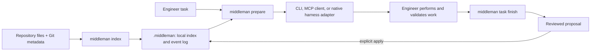

# Middleman

Middleman is a local, deterministic context broker for software-engineering
agents. It indexes a repository, produces a bounded context packet for a task,
records task outcomes, and accepts durable project knowledge only through an
explicit review workflow.

It is deliberately not an agent runtime, model proxy, cloud service, vector
database, or source-code store. The universal product contract is the local
CLI; MCP and harness adapters are conveniences over that contract.

## What it provides

- A source-free local project index of modules, symbols, documents, tests, and
  their observed relationships.
- Deterministic task routing and bounded packets in CIR, Markdown, or JSON.
- An append-only, hash-chained event log for tasks, retrieval outcomes, and
  reviewed durable facts.
- Structured proposal review for decisions, invariants, and contracts.
- Optional, local-only learning suggestions based on retrieval outcomes. AI is
  disabled by default and Middleman never manages model credentials or makes
  model requests.



## Support matrix

| Harness or interface | Integration | Lifecycle automation | Platform notes |
| --- | --- | --- | --- |
| Any coding harness | Universal CLI and `AGENTS.md` instruction block | Cooperative: the harness follows the repository instructions | All platforms supported by Rust and Git |
| Any MCP-capable harness | Local stdio `middleman-mcp` server | The harness invokes the three tools | No network listener or model proxy |
| Pi | Repository extension | Automatic prepare, material-work observation, and task finish | Install the repository extension files |
| Kilo Code | Project MCP server and custom mode | Custom mode guides the lifecycle; no undocumented background hook is used | Use absolute executable and repository paths |
| Cline | Project MCP server and repository hooks | Hooks automate prepare, material-work observation, finish, and cancellation | Hooks are supported on macOS/Linux; Windows uses MCP/CLI |
| Codex and Claude Code | Universal CLI/`AGENTS.md`; optional manual MCP registration | Cooperative | No native Codex or Claude Code adapter is shipped yet |

The shipped MCP server intentionally exposes only `middleman_prepare`,
`middleman_expand`, and `middleman_propose`. It also exposes the compact
`middleman://project/current`, `middleman://task/{id}`, and
`middleman://node/{id}` resource surface. It does not offer arbitrary file,
shell, or database access.

## Prerequisites

- Rust 1.85 or newer (the workspace uses Rust edition 2024).
- Git, for Git-aware indexing and task-finish evidence.
- A local Node runtime only when using the Pi extension or Cline hooks.
- A checked-out Middleman source tree. The project currently documents a
  source-build workflow rather than publishing an installable release.

From the repository root, build both local binaries:

```sh
cargo build --offline -p middleman-cli -p middleman-mcp
```

The binaries are then `target/debug/middleman` and
`target/debug/middleman-mcp` (`.exe` on Windows). Add that directory to `PATH`
for the current shell, or use absolute paths when configuring a harness.

PowerShell example:

```powershell
$env:Path = "$(Get-Location)\target\debug;$env:Path"
middleman --version
Test-Path "$(Get-Location)\target\debug\middleman-mcp.exe"
```

POSIX shell example:

```sh
export PATH="$(pwd)/target/debug:$PATH"
middleman --version
```

## First project setup

Run these commands against the project Middleman should serve, not necessarily
against the Middleman source checkout. `--repo` makes that boundary explicit.

```sh
middleman --repo /absolute/path/to/project init
middleman --repo /absolute/path/to/project index --full
middleman --repo /absolute/path/to/project doctor
middleman --repo /absolute/path/to/project status
```

`init` creates `.middleman/`. Its generated state database is ignored; the
local `middleman.toml` configuration is retained. `doctor` verifies the state,
configuration, event-log hash chain, and Git availability before you rely on
the project state.

Generate the portable instruction block after the first index. This command
updates the target repository's tracked instruction file, so review its diff
before committing it.

```sh
middleman --repo /absolute/path/to/project render agents-md --write
middleman --repo /absolute/path/to/project render agent-context --write
```

The generated `AGENTS.md` block asks a cooperative harness to prepare context
before broad investigation, expand only selected references, and submit durable
facts as reviewable proposals instead of editing Middleman-managed memory.

## Universal CLI workflow

Use this workflow with Codex, Claude Code, or any other coding environment.
It is also the reliable fallback when an adapter is unavailable.

1. Refresh the index before starting material work:

   ```sh
   middleman --repo /absolute/path/to/project index --changed
   ```

2. Create a tracked task. The command returns JSON containing a generated
   `task_...` identifier. Task text is used to route the work but is not stored
   as durable project memory.

   ```sh
   middleman --repo /absolute/path/to/project task start \
     --task "Add lease-renewal validation" \
     --validation "cargo test -p lease"
   ```

3. Request a bounded packet for the same task. Markdown is usually the best
   interactive format; JSON is appropriate for automation.

   ```sh
   middleman --repo /absolute/path/to/project prepare \
     --task "Add lease-renewal validation" \
     --format markdown \
     --budget 1200
   ```

4. Inspect a selected item instead of scanning the repository broadly. Use an
   entity ID returned by the packet or by `search`.

   ```sh
   middleman --repo /absolute/path/to/project search "lease renewal"
   middleman --repo /absolute/path/to/project expand <entity-id> --format markdown
   middleman --repo /absolute/path/to/project explain <entity-id>
   ```

5. After implementation and human-run validation, finish the task. Middleman
   records the commands you report; it never executes them on your behalf.

   ```sh
   middleman --repo /absolute/path/to/project task finish <task-id> \
     --from-git \
     --passed "cargo test -p lease"
   ```

6. When the work establishes a durable decision, invariant, or contract,
   submit a structured, evidence-backed proposal. `--from-git` adds bounded
   current Git evidence; the JSON input supplies the claims themselves.

   ```sh
   middleman --repo /absolute/path/to/project propose \
     --task-id <task-id> \
     --input proposal.json \
     --from-git \
     --format markdown
   middleman --repo /absolute/path/to/project review <proposal-id>
   middleman --repo /absolute/path/to/project apply <proposal-id>
   # or: middleman --repo /absolute/path/to/project reject <proposal-id> --reason "Not durable"
   ```

Proposal input has top-level `decisions`, `invariants`, and `contracts` arrays.
Each claim has a label, statement, rationale, selected entity IDs in `scope`,
evidence references, and optional kind-specific `details`. Obtain valid entity
IDs with `search` or `prepare`; do not invent them. The proposal validator
rejects missing scope or evidence, inactive references, invalid shapes, and
duplicate active facts.

## MCP setup

MCP-capable clients launch `middleman-mcp` as a local stdio process. The server
requires the target repository through `--repo`. A generic configuration shape
is:

```json
{
  "mcpServers": {
    "middleman": {
      "command": "/absolute/path/to/middleman-mcp",
      "args": ["--repo", "/absolute/path/to/project"],
      "disabled": false
    }
  }
}
```

On Windows use escaped backslashes and the `.exe` filename, for example:

```json
{
  "mcpServers": {
    "middleman": {
      "command": "C:\\tools\\middleman\\target\\debug\\middleman-mcp.exe",
      "args": ["--repo", "C:\\work\\project"],
      "disabled": false
    }
  }
}
```

The process communicates only over its standard input and output. Keep its
paths local and absolute. If connection fails, confirm `middleman doctor` in
the target repository and run the universal CLI workflow rather than adding a
remote fallback.

## Pi setup

1. Build `middleman` and make it available on Pi's `PATH`.
2. Initialize the target repository with `middleman init`.
3. Copy these adapter files into the target repository:

   ```text
   crates/adapters/pi/middleman.ts             -> .pi/extensions/middleman.ts
   crates/adapters/pi/middleman-lifecycle.mjs  -> .pi/extensions/middleman-lifecycle.mjs
   ```

The extension performs an incremental index, starts a Middleman task, injects a
1,200-token Markdown packet, and records material edits. On settlement it
finishes the task from Git observations. A durable claim still requires an
explicit `middleman_propose` call and CLI review/apply or reject decision.

If the binary or `.middleman/` state is unavailable, Pi continues with a
visible fallback and no injected packet. It does not attempt network recovery
or retain prompts, rendered packets, or raw tool output in adapter state.

## Kilo Code setup

1. Build both binaries and initialize the target repository.
2. In Kilo's project MCP settings, add the `middleman-mcp` configuration from
   the [MCP setup](#mcp-setup) section, using absolute local paths.
3. Copy `crates/adapters/kilo/middleman-mode.yaml` to the target repository as
   `.kilocodemodes`.
4. Select **Middleman lifecycle** for the task.

The mode directs the normal `index --changed`, task start, packet retrieval,
and review process. Kilo's supported integration surface is MCP plus custom
modes; this project deliberately does not claim unsupported background lifecycle
hooks or plugins. If the MCP server is unavailable, perform the same lifecycle
with the CLI.

## Cline setup

1. Build both binaries and initialize the target repository.
2. In Cline's MCP configuration (`~/.cline/mcp.json` or the Configure MCP
   Servers UI), add the local `middleman-mcp` configuration from the
   [MCP setup](#mcp-setup) section. Leave `autoApprove` empty so the agent
   cannot silently authorize unrelated work.
3. Copy these files into `.clinerules/hooks/` in the target repository:

   ```text
   crates/adapters/shared/middleman-lifecycle.mjs -> .clinerules/hooks/middleman-lifecycle.mjs
   crates/adapters/cline/middleman-hook.mjs       -> .clinerules/hooks/middleman-hook.mjs
   crates/adapters/cline/middleman-hook-entry.mjs -> .clinerules/hooks/middleman-hook-entry.mjs
   crates/adapters/cline/UserPromptSubmit         -> .clinerules/hooks/UserPromptSubmit
   crates/adapters/cline/PreToolUse                -> .clinerules/hooks/PreToolUse
   crates/adapters/cline/TaskComplete              -> .clinerules/hooks/TaskComplete
   crates/adapters/cline/TaskCancel                -> .clinerules/hooks/TaskCancel
   ```

4. On macOS/Linux, make the four extensionless files executable and enable
   hooks in Cline settings:

   ```sh
   chmod +x .clinerules/hooks/UserPromptSubmit \
     .clinerules/hooks/PreToolUse \
     .clinerules/hooks/TaskComplete \
     .clinerules/hooks/TaskCancel
   ```

`UserPromptSubmit` indexes, prepares a 1,200-token Markdown packet, and
starts a task. `PreToolUse` marks known write tools as material work.
`TaskComplete` records Git-based completion and asks for evidence-backed
proposal claims; `TaskCancel` clears temporary lifecycle state. The hooks store
only a hashed Cline task key, a Middleman task ID, and boolean lifecycle flags
under `.middleman/cache`.

Cline's executable hooks are not supported on Windows. On Windows, configure
the MCP server and use the universal CLI workflow; do not emulate the hooks.

## Codex and Claude Code setup

There is no shipped native adapter for either harness. Use the portable setup:

1. Initialize and index the project.
2. Run `middleman render agents-md --write`, then review and commit the change
   to the target project's `AGENTS.md` when appropriate.
3. Ensure the `middleman` binary is on the harness's `PATH`.
4. Follow the [universal CLI workflow](#universal-cli-workflow), or manually
   register the local stdio MCP server if the harness supports project MCP
   configuration.

This preserves the same local state across harnesses without implying that a
native lifecycle extension is installed.

## Learning, maintenance, and optional AI

Retrieval learning is deterministic and advisory. Inspect suggestions before
changing local retrieval weights:

```sh
middleman --repo /absolute/path/to/project learn suggest
middleman --repo /absolute/path/to/project learn apply
```

`learn apply` changes only `.middleman/middleman.toml`. It does not mutate the
event log. You can also record explicit feedback for a retrieved node with
`learn observe --node <entity-id> --signal <signal> [--task-id <task-id>]`.

Optional AI is disabled by default. If you deliberately enable a `harness`,
`local`, or `remote` mode in `.middleman/middleman.toml`, `learn summarize`
only validates and displays bounded structured suggestions from a file. It does
not call a model, send a request, store proposal content, or write durable
memory. Durable facts always use `propose`, `review`, and an explicit `apply`.

## Operations and recovery

Use `status` for a concise local-state summary and `doctor` for state,
configuration, event-log, and Git checks. The event log can be moved or backed
up without chat history:

```sh
middleman --repo /absolute/path/to/project export --format jsonl > middleman-events.jsonl
middleman --repo /absolute/path/to/project backup /safe/path/middleman-backup.jsonl
middleman --repo /absolute/path/to/project restore /safe/path/middleman-backup.jsonl
```

Treat import and restore as replacement operations for the target project's
local Middleman state. Verify the path and take a backup first. Keep backups
outside the repository unless that is an intentional, reviewed project policy.

## Development and verification

Focused checks are usually sufficient while changing one subsystem. Before
committing a material Rust change, run the repository's required gates:

```sh
cargo test --workspace --offline
cargo clippy --workspace --all-targets --offline -- -D warnings
cargo fmt --all --check
```

Adapter contract tests can be run with:

```sh
node --test crates/adapters/pi/middleman-lifecycle.test.mjs \
  crates/adapters/cline/middleman-hook.test.mjs \
  crates/adapters/kilo/middleman-mode.test.mjs
```

The detailed harness notes live in
[`docs/integrations`](docs/integrations/), and the full product behavior is in
[`context-broker-implementation-spec.md`](context-broker-implementation-spec.md).
