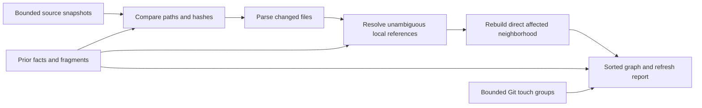

# Task: Derived graph and incremental refresh

## Objective

Turn bounded scan/language/document/Git observations into deterministic core
entities and evidence-backed relationships. Refresh changed files and their direct
neighborhood while retaining unchanged parsed facts and graph fragments.

## Scope

- Files / modules: `crates/core/src/ids.rs`, ordering on `EdgeKind`,
  `crates/indexer/src/graph/`, `crates/indexer/src/graph.rs`, direct tests,
  language namespace metadata, and a SQLite compatibility test in `crates/store`.
- Out of scope: CLI wiring, database persistence/migrations, routing/scoring,
  semantic compilation, automatic durable claims, and execution of source code.
- Planned commit: `feat(indexer): derive evidence-backed graphs and incremental refresh`.

## Contract and operational impact

- Extend entity IDs additively with validated `mod:`, `sym:`, `test:`, `doc:` and
  the other planned namespaces; existing prefixed ULIDs remain valid. Generated
  keys encode UTF-8 components and separators, independent of checkout location.
- Derived observations remain separate from reviewed decisions/invariants/contracts.
  Document authority is observed, never promoted from untrusted frontmatter.
- No event/schema mutation: return a complete graph and deterministic refresh report.
  Persistence must later replace the derived projection explicitly; existing
  `EdgeDeclared` appends alone cannot safely remove obsolete derived edges.

## Functional design

- Pure `refresh` accepts bounded source snapshots, optional Git observations, and
  prior opaque in-memory state. It validates hashes, paths and budgets; parses
  changed inputs; resolves local references; rebuilds affected fragments; assembles
  sorted results. Errors leave the previous state untouched.
- Canonical path catalogs and cached reference candidates catch newly added targets,
  removed targets and ambiguity changes. Only one direct neighborhood is expanded.
- Changes to parsing limits invalidate cached facts. Hash verification still scans
  input bytes; incremental savings concern parsing and fragment derivation, not I/O.
- Separate co-change evidence from dependency edges. Bound nodes, edges and
  co-change expansion; fail rather than silently truncate the graph.

## Decisions

- Module nodes represent files. Owned declaration nodes carry source-line/hash
  evidence; test nodes and static test-import links do not claim measured coverage.
- Resolve exact local document/routing references and conservative language imports.
  Ambiguous, external or unsupported references remain diagnostics, not guessed edges.
- Symbol keys use path, kind, name and occurrence among identical names; adding
  unrelated lines/declarations preserves identity. Renames change identity.
- Use Cargo manifest metadata only as bounded parsed data to resolve local Rust
  crate names; never invoke Cargo or infer unknown dependencies from basenames.
- Diagnostics retain source location and reason, not raw external URLs. Paths in
  graph payloads and generated IDs use repository-relative forward slashes.
- There is no inferred test command or measured coverage: unknown commands remain
  empty. Co-change pair expansion has a separate budget and is not a dependency.

## API and limitations

- `graph::refresh(previous, files, history, limits, budget)` returns an opaque
  in-memory `Index` plus `Changes`. Read the complete graph via `index.graph()`.
  Supply the complete current accepted file snapshot, not just changed files;
  omitted paths are removed from the derived index. Supply current Git observations
  on each call; `None` clears co-change evidence.
- `reparsed` counts source parsers; `rederived` counts rebuilt fragments; `reused`
  counts reused fragments. Reference resolution checks cached facts against the
  current catalog globally to detect additions/ambiguity. Graph assembly and input
  hash verification still process the snapshot. No filesystem or timing speedup
  is claimed. Unchanged facts and fragments share immutable allocations.
- Resolvers cover local Rust crate/module hints, relative JS/TS paths, Elm module
  names, PHP namespace/class imports, basic Python paths and local document links.
  They do not evaluate Cargo features/dependency aliases, TS config aliases,
  Go module resolution, directory-wide doc targets, URL decoding or full compiler
  semantics. Unsupported or ambiguous forms produce location-based diagnostics.
- Parser and graph work have byte/count bounds; the pure graph stage does not read
  a clock. Malformed Cargo manifests and invalid snapshots fail without changing the
  previous cache. There is no on-disk cache format or CLI wiring in this slice.
- Existing stored IDs/events remain readable. Older binaries will not recognize
  newly introduced namespaced IDs; no such IDs are written by the CLI yet.

## Changes made

- Added `graph.rs` orchestration, `graph/facts.rs` for owned entities/evidence,
  and `graph/resolve.rs` for conservative local reference resolution.
- Added validated namespaced IDs in core, deterministic edge ordering and
  namespace metadata in language observations. Reused existing workspace TOML
  and proptest dependencies; updated `Cargo.lock`.
- Added `core/tests/derived_ids.rs`, `indexer/tests/graph_refresh.rs`, and the
  focused SQLite round-trip compatibility test in `store/tests/store_tests.rs`.

## Validation

- Passed on Windows: `cargo test --workspace --offline` (62 tests),
  `cargo clippy --workspace --all-targets --offline -- -D warnings`, and
  `cargo fmt --all --check`.
- Full/incremental equivalence after edits, additions, removals, renames,
  configuration changes, unresolved-to-resolved links and new ambiguity, including
  64 randomized edit sequences. Stable identity, evidence, deterministic ordering,
  no dangling edges, bounded expansion and no-op cache reuse are covered.
- The direct-neighborhood test reparses only `c.ts` and rebuilds `b.ts`/`c.ts`,
  retaining `a.ts` and an unrelated file. The no-op test reports zero reparsing
  and zero fragment rebuilding; these are work-count checks, not timing benchmarks.
- The SQLite test verifies append/reopen/replay equality with a namespaced ID.
  Existing core hash-chain and storage tests pass unchanged. Unix-only tests were
  not run on this Windows host; fixture source was not executed.

## Next step / handoff

After this slice: classification and scoring. CLI indexing/persistence remains a
later integration step; read the graph API and this note rather than conversation logs.
