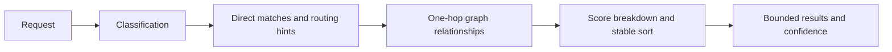

# Task: deterministic classification and scoring

## Objective and scope

Implement spec section 9 in the pure core under
`feat(core): classify tasks and score context candidates`.
Packet selection, rendering, CLI wiring, and learned weights are subsequent work.

## Contract and operational impact

Add an in-memory API consuming entities, edges, and caller-supplied routing and
history hints. No I/O, event changes, configuration changes, or migrations.
Issue identifiers, URLs, headings and tags enter as explicit routing phrases;
the core never fetches their contents. Callers decide recency from bounded history
and open task scope. Ignored and non-active entities cannot be selected or seed
neighbors. Stale entities receive an explicit caller-supplied nonnegative penalty.

## Functional design and decisions

- Classify request keywords into task modes; an explicit mode overrides inference.
- Match case-sensitive paths/symbols with boundaries, normalize path separators;
  match routing phrases and contract titles case-insensitively with boundaries.
- Apply the specification's integer weights once per signal, regardless of
  duplicate rules/edges. Only direct matches seed one-hop relationships, preventing
  cycles and large-degree entities from accumulating recursive relevance.
- Confidence is a heuristic, not a probability: strongest direct signal among
  returned candidates after its stale penalty, capped at 100. Below 55 is low confidence.
- Sort by descending score then entity ID; return positive results up to the
  requested limit with an explicit truncation flag. Retain reasons and exclusions.
- Keep the workflow in one module with small pure matching/scoring helpers;
  avoid a generic rule engine or dependency on the indexer.

## Changes made

- `crates/core/src/routing.rs`: classification, typed metadata and ranking results,
  fixed scoring weights, exclusions, stable ordering and confidence.
- `crates/core/tests/routing.rs`: seven tests exercising weights, matching,
  explicit modes, history, ties, limits, lifecycle exclusions, stale penalties,
  duplicate and self edges, and one-hop expansion.
- Dependencies and persisted schemas are unchanged.

## Validation

- `cargo test --workspace --offline`: all 69 tests passed on Windows.
- `cargo clippy --workspace --all-targets --offline -- -D warnings`: passed.
- `cargo fmt --all --check`: passed.
- After the self-link guard, all seven focused routing tests passed again;
  Clippy and formatting were checked against the final code.
- Fixture code was not executed. No performance benchmark or CLI phase-exit
  validation was performed; this is an in-memory core API.

## Next step / handoff

Build packet selection and renderers on the ranked IDs. The indexing/CLI adapter
must populate routing phrases from parsed documents, co-change pairs, recent file
IDs and task scope; these hints do not create durable claims.

Inputs must already be bounded by adapters. Phrase matching is literal, not fuzzy,
stemming or semantic search; punctuation that is also a path character is treated
conservatively. Inferred modes are descriptive; only explicitly selected modes
activate mode routing. Dependency and test links retrieve either direct endpoint;
they do not assert runtime call flow or test coverage. Stale nodes never seed
expansion. Unknown/dangling references contribute nothing. Confidence is a fixed
heuristic with no learned calibration. Signal reasons identify scoring categories;
source evidence remains on the referenced entities/edges for packet explanations.
