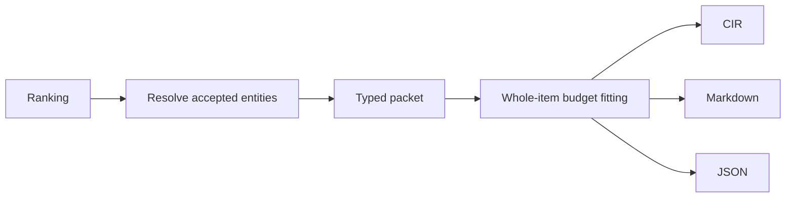

# Task: bounded context packets

## Objective and scope

Commit: `feat(packet): render bounded context packets`.
Implement typed packets, CIR/1 parsing/rendering, Markdown/JSON rendering and
deterministic budgets. CLI integration and persistence remain the next slice.

## Contract and operational impact

Pure in-memory transformation of ranking and accepted entities. No schema or
configuration migration. Callers supply sanitized task metadata and constraints;
packets contain curated summaries and source references, never source bodies or
raw tool output. Validation commands are recommendations, never executed here.

## Functional design and decisions

- One typed packet feeds all renderers. CIR/1 uses one keyword and JSON value per
  line to preserve Unicode, whitespace and delimiters without ambiguous escaping.
- Whole items are removed from lowest rank until the actual rendered estimate
  fits. Required metadata and constraints are never truncated. Fail explicitly
  if this minimum packet does not fit.
- CIR estimate: whitespace tokens. Markdown/JSON: Unicode characters divided by
  four, rounded up. Defaults: CIR 1200, Markdown/JSON 2000. These are deterministic
  estimates, not model tokenizer guarantees.
- Selected test commands are deduplicated; commands disappear with omitted tests.
  A bounded set of remaining ranked IDs is expandable. Missing and inactive IDs
  cannot be rendered. Low confidence remains explicit after selection.
- No generic templating/rule engine: model, selection and codec have separate
  responsibilities in one sequential pipeline.

## Changes made

- `crates/packet/src/model.rs`: packet header, selected items, expandable references,
  format defaults and typed errors.
- `selection.rs`: stable ID resolution, exclusions, whole-item budget fitting,
  command deduplication and confidence after trimming.
- `codec.rs`: three renderers, strict CIR parser and deterministic estimators.
- `crates/packet/tests/packets.rs`: seven focused tests, including task-to-packet
  expected IDs, budgets, escaping and sampled Unicode round-trip properties.

## Validation

- `cargo test --workspace --offline`: 75 tests passed on Windows.
- Final focused `cargo test -p middleman-packet --offline`: seven tests passed,
  including an additional confidence regression and missing-entity assertion.
- `cargo clippy --workspace --all-targets --offline -- -D warnings` and
  `cargo fmt --all --check`: passed against final code.
- No fixture source executed. CLI exit criteria and model-tokenizer measurements
  remain unrun; this slice exposes only a pure library API.

## Next step / handoff

CLI prepare/expand/search/explain should consume this API and supply sanitized
metadata. Persist packet identity and retrieval outcomes at the CLI/store boundary.

Canonical CIR grammar: `CIR/1`, then exactly one `P <Header JSON>` line, followed
by zero or more `R <Item JSON>`, `E <Reference JSON>`, and `X <string JSON>` lines.
Unknown keywords/fields, duplicate IDs, invalid typed IDs and inputs above 1 MiB
are rejected. The illustrative unquoted syntax in spec section 7 is not accepted;
this is the first implemented dialect, so there is no existing wire migration.
Validation commands are fields of selected test items, exposed as a deduplicated
set by `validation_commands()`. Renderers do not execute them.

Use `prepare` for budgeted output; `render` is a raw codec and takes no budget.
The returned text, packet and estimate refer to the same final selection. Inputs
must be bounded and sanitized by callers; this layer is not a secret detector.
Defaults cap selection at 24 items and eight expandable ranked references. Optional
references are removed before selected items under budget pressure. Omission counts
include unavailable candidates and removed items; an upstream flag distinguishes
unknown omissions from ranking truncation. Per-kind caps and per-ID omission
explanations can be applied by the CLI using the original ranking and selected IDs.
Mandatory invariants must be supplied in constraints if they must survive budget
fitting. Entity summaries, unlike explicit constraints, are optional ranked items.
