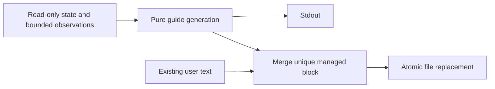

# Task: generated agent guides

## Objective and scope

Commit: `feat(cli): render repository agent guides`.
Implement render agents-md and render agent-context, defaulting to stdout with
optional --write to fixed repository paths. No events or automatic durable claims.

## Contract and operational impact

With --write, replace only a uniquely marked Middleman block or append one if
absent. Preserve other bytes and existing newline style. Reject malformed markers,
linked/reparse output paths, and files larger than 1 MiB. Use same-directory
temporary files and atomic replacement, retaining existing file permissions.
Reject a changed destination detected before replacement; no unconditional rewrite.

## Functional design

Pure packet-layer guide generation and block merging; CLI handles read-only state,
bounded observations and file writes. Guides list observed references and active
domain facts without inventing module responsibilities. Exclude guide output paths
from generated inventories so regeneration does not include itself.



## Decisions

Only document implemented commands. Proposal/task workflow instructions will be
added when those commands exist. Agent-context inventories are bounded per category
with explicit omissions; source bodies and raw tool output are never copied.

## Changes made

- `crates/packet/src/guides.rs`: pure integration text, observed map generation,
  Markdown escaping and managed-block merge. Existing packet escaping is reused.
- `crates/cli/src/guides.rs`: render options, bounded file reads, path guards,
  optimistic destination check and atomic replacement. `retrieval.rs` exposes
  the existing read-only input pipeline without making routing internals public.
- CLI uses the already locked tempfile dependency at runtime for safe replacement.
- Three pure guide tests and five CLI tests cover preservation and write behavior.

## Validation

- `cargo test --workspace --offline --quiet`: all 90 tests passed on Windows.
- `cargo clippy --workspace --all-targets --offline -- -D warnings`: passed.
- `cargo fmt --all --check`: passed.
- Verified LF/CRLF preservation, unchanged user prefix/suffix, repeat-write
  idempotence, preview without writes, no event appends, missing docs creation,
  malformed markers, bounded inventories, self-reference exclusion, Markdown
  escaping and a Windows junction that cannot redirect writes outside the repo.
- Unix symlink branch was not run here. Fixture/source code was not executed.
  No crash/power-loss or concurrent hostile filesystem replacement test was run.

## Next step

Task start/finish and automatic observations.

## Usage and limits

```text
middleman render agents-md
middleman render agent-context --format json
middleman render agents-md --write
middleman render agent-context --write --format json
```

Default stdout is the proposed complete file, including preserved user content.
JSON preview wraps it as path/content; JSON writes return path/changed. Both
commands require initialized broker state and emit structured errors. They append
no events and do not modify the source repository’s guides unless --write is used.
Only fixed AGENTS.md and docs/agent-context.md destinations are supported.

Managed blocks use standalone `<!-- middleman:begin -->` and
`<!-- middleman:end -->` markers. Only one correctly ordered pair is accepted.
Outside content is byte-preserved in UTF-8 files; new block lines use the existing
CRLF style when present. The merge refuses files above 1 MiB or a generated body
above 64 KiB. Context lists at most six docs, eight modules, five tests, eight
active domain facts and five risks/questions, with omitted counts. The map is
explicitly incomplete and does not infer responsibilities or operating commands.

Writes use a temporary file in the same directory, sync its content and preserve
portable permissions before replacement. Existing text is rechecked immediately
before replacement; new files use no-clobber persistence. This is an optimistic
edit check, not protection against malicious replacement in the final race window.
Directory fsync and preservation of platform-specific ownership/ACL metadata are
not guaranteed. An error before persistence leaves the destination untouched.

The root project’s own AGENTS.md and context document were not regenerated in this
implementation slice. Later lifecycle/proposal work should extend the integration
block when the corresponding commands become available.
