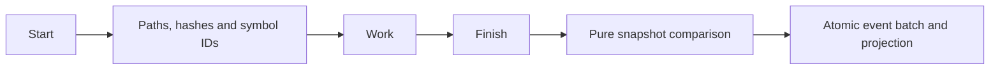

# Task: lifecycle and automatic observations

## Objective and scope

Commit: `feat(cli): track task lifecycle and observations`.
Implement task start/finish/show, baseline comparison, reported validation and
atomic event batches. Durable proposals, applying claims and persistent indexing
remain separate slices.

## Contract and operational impact

Task start uses request text transiently for routing. Default persisted objectives
are generated from selected IDs; --objective and --summary explicitly store curated
text. Snapshots contain accepted paths/hashes, symbol IDs and optional Git HEAD,
never source bodies, raw prompts, command output or identities.

Start + baseline and finish observations + completion must each append atomically.
TaskObserved is an additive event; old events remain readable. Task record snapshot
fields default when absent. No SQLite schema change; older binaries cannot replay
the new event. Duplicate starts and terminal transitions are rejected by the core.

## Functional design and decisions

Compare bounded snapshots in the core. Added/changed/unavailable paths describe
observations, not causality; unavailable may mean deletion, exclusion or a scan
limit. Existing dirty edits in the baseline do not count as task changes.
Symbol additions/removals are index hints, not semantic API changes.
--from-git captures restricted Git observations at finish; it never executes code.
Validation status is user-reported through explicit flags, never inferred or run.



## Changes made

- `crates/core/src/task.rs`: bounded snapshot model, pure path/symbol comparison
  and automatic summary. TaskObserved events project baseline/completion fields;
  projection rejects duplicate starts/observations and repeat terminal transitions.
- `crates/store/src/lib.rs`: append_batch validates and projects one bounded batch
  under the writer lock in one transaction; append delegates to it. Tail checks
  now occur after acquiring the lock, closing the previous cooperating-writer race.
- `crates/cli/src/tasks.rs`: task start/finish/show, generated or explicitly curated
  objectives/summaries, reported validation and atomic lifecycle event batches.
- `retrieval.rs`: shared bounded scan supplies normalized path/hash snapshots.
- Generated integration guidance now documents task lifecycle commands.
- Core, store and child-process CLI tests exercise observations and recovery.

## Validation

- `cargo test --workspace --offline --quiet`: all 98 tests passed on Windows.
- Final four focused CLI task tests also passed after adding a low-confidence
  handoff message for uncertain task scope.
- `cargo clippy --workspace --all-targets --offline -- -D warnings` and
  `cargo fmt --all --check`: passed.
- Tests cover changed/added/unavailable paths, unchanged initial edits, symbol
  snapshots, legacy records, duplicate observations/finish, invalid-batch rollback,
  committed batch reopening, explicit validation, raw prompt/source exclusion,
  ignored secret files, and separate-process task inspection.
- A temporary synthetic Git history verifies --from-git HEAD changes. No fixture
  source, test/build command or repository hook was executed by Middleman.
- No performance benchmark or Unix run; snapshot comparison describes endpoint
  observations rather than proving which actor caused a change.

## Next step

Proposal validation, then propose/review/apply/reject.

## Usage and limits

```text
middleman task start --task "lease renewal"
middleman task start --task "lease renewal" --objective "Update lease handling" --validation "cargo test"
middleman task finish task_<ID> --from-git --passed "cargo test"
middleman task show task_<ID>
```

All three commands return JSON. --objective/--summary explicitly persist curated
text; --task is used only for routing. Start stores at most 24 context IDs plus
baseline observations and task-linked retrieval signals. Low-confidence routing
adds a persisted handoff message to confirm scope. Show is read-only and includes
the baseline; start/finish responses omit that potentially large hash map.

Finish records filesystem/symbol comparisons even without --from-git. That flag
adds restricted Git HEAD/history metadata and requires a Git repository. It does
not enumerate commits since start or infer command/test results. --passed, --failed
and --skipped report results explicitly; conflicting/duplicate commands fail.
Completion means the task ended, not that reported tests passed. Missing historical
baselines are explicit and do not invent additions/deletions.

Requests are bounded to 16 KiB, curated text to 4 KiB, validation to 64 commands
of at most 2 KiB each. Snapshots allow at most 100,000 file and symbol entries,
with 8 MiB limits on each set of path/ID bytes; stored paths use forward slashes.
An unavailable path can be deleted, newly ignored, or outside current scan limits.
There is no content snapshot or raw output capture. Existing one-writer lock and
SQLite transaction semantics protect batches; maximum batch size is 256 events.

No SQLite schema migration. New TaskObserved events require upgraded readers.
Legacy unique/open task histories and records remain supported; histories that
previously overwrote duplicate task IDs or repeated terminal transitions are now
rejected. Task lifecycle does not create decisions, invariants or contracts.
