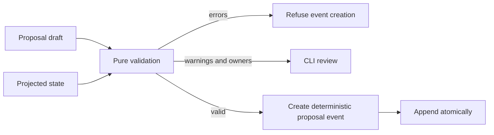

# Task: proposal validation

## Objective and scope

Commit: `feat(core): validate durable memory proposals`.

Add a pure validator for decision, invariant, and contract drafts. Proposal input,
review, acceptance, and rejection commands are the next work.

## Contract and operational impact

The API consumes a draft and projected state, then returns a serializable report.
It has no I/O, clocks, randomness, event appends, schema changes, or side effects.
Its report is an input-validation result; it does not authorize applying durable
memory.

## Functional design and decisions

- Reject empty or oversized drafts, unsupported fact kinds, blank or oversized
  text, control characters, duplicate in-draft claims, missing tasks, invalid or
  inactive scope references, missing or invalid evidence, unknown source,
  document, or Git paths, and lexical duplicates of active facts.
- Require evidence, while allowing an empty scope for repository-wide claims.
  Scope outside an existing task is a review warning rather than a hard error.
- Validate hashes and SHAs syntactically and resolve path references against
  active state. Test results are shaped but not rerun; user approvals need a
  nonempty actor.
- Exact duplicate detection normalizes case and whitespace. Natural-language
  contradiction cannot be safely inferred, so human review remains responsible
  for it.
- Surface affected owners declared on scoped active decisions, contracts, and
  risks. This is a conservative notification list, not authorization policy.

## Changed paths

- `crates/core/src/proposal.rs`
- `crates/core/src/lib.rs`
- `crates/core/tests/proposals.rs`

## Validation

- `cargo test --workspace --offline --quiet`
- `cargo clippy --workspace --all-targets --offline -- -D warnings`
- `cargo fmt --all --check`

## Next step

The CLI must merge fresh bounded graph entities with projected state before
validating a draft, refuse reports with errors, expose warnings and affected
owners for review, create deterministic entities only after validation succeeds,
and append resulting proposal events atomically. Review, apply, and reject remain
separate commands.
