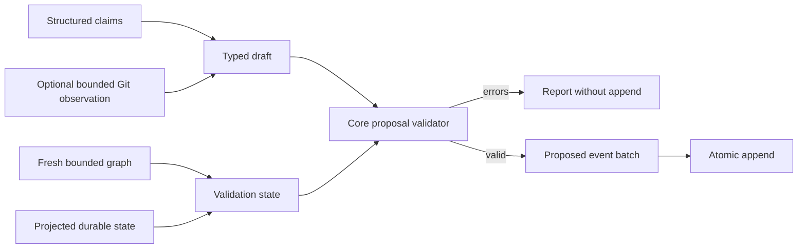

# Task: validated proposal intake

## Objective and scope

Commit: `feat(cli): add validated proposal intake`.

Add `middleman propose` for structured decision, invariant, and contract claims.
It produces a reviewable proposal event batch only after core validation succeeds.
Review, apply, and reject are separate work.

## Decisions

- Require a structured JSON file. Git changes alone do not establish the meaning
  of a durable claim, so `--from-git` enriches explicit claims with bounded Git
  evidence instead of inventing facts.
- Scan the current repository and merge its fresh graph entities with projected
  durable state before validation. This permits source and document evidence to
  refer to the current bounded scan without persisting it as a side effect.
- Treat validation errors as a refusal to append. Return the serializable report
  for errors, warnings, and affected owners; append all valid proposed claims in
  one atomic store batch under one proposal identifier.
- Permit only decision, invariant, and contract claims in this command. Raw input
  is bounded and decoded with an explicit schema.

## Validation

- `cargo test -p middleman-cli --test proposals --offline`
- `cargo test --workspace --offline --quiet`
- `cargo clippy --workspace --all-targets --offline -- -D warnings`
- `cargo fmt --all --check`

All checks pass on Windows. The Git integration test reads repository metadata
through the bounded adapter; fixture source is never executed.

## Changed paths

- `crates/cli/src/main.rs`
- `crates/cli/src/proposals.rs`
- `crates/cli/tests/proposals.rs`
- `crates/cli/Cargo.toml`

## Next step

Add proposal review, acceptance, and rejection commands. Acceptance must create
typed active entities atomically and preserve the proposal identifier as its
review trail.
