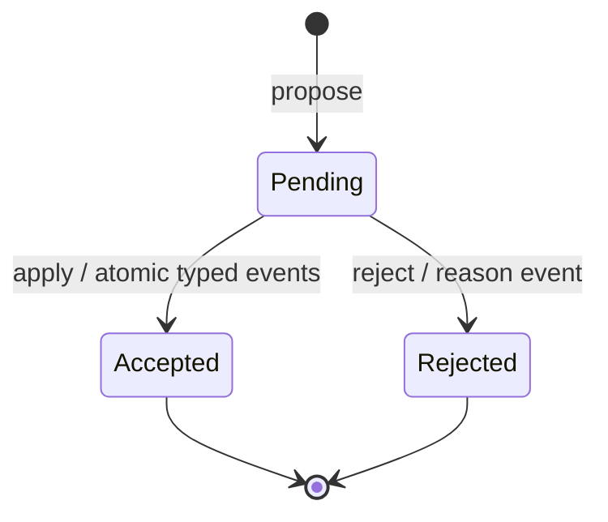

# Task: proposal review lifecycle

## Objective and scope

Commit: `feat(cli): add proposal review lifecycle`.

Add `review`, `apply`, and `reject` commands for pending durable-memory
proposals. This completes the review-gated state transition in Phase 2.

## Decisions

- Claims retain explicit kind-specific details until acceptance. An invariant
  requires its consequence; a contract requires input and output. The CLI never
  invents those fields during application.
- `review` is read-only. `apply` turns every claim in one pending proposal into
  a typed active entity, using deterministic entity IDs derived from the proposal
  ID and claim position, then appends the acceptance events atomically.
- `reject` appends one reasoned rejection event. Accepted and rejected proposals
  are terminal; repeated application or rejection is refused.
- Proposal projection records accepted state with a serde default so historical
  event logs remain readable. Status output now distinguishes pending, accepted,
  and rejected proposals.

## Validation

- `cargo test -p middleman-cli --test proposals --offline`
- `cargo test --workspace --offline --quiet`
- `cargo clippy --workspace --all-targets --offline -- -D warnings`
- `cargo fmt --all --check`

The focused suite covers read-only review, acceptance, rejection, terminal-state
refusal, and Git evidence from the preceding intake slice. Fixture source is not
executed.

## Next step

Implement export, import, backup, and restore while retaining append-only event
verification and the single-writer store boundary.
