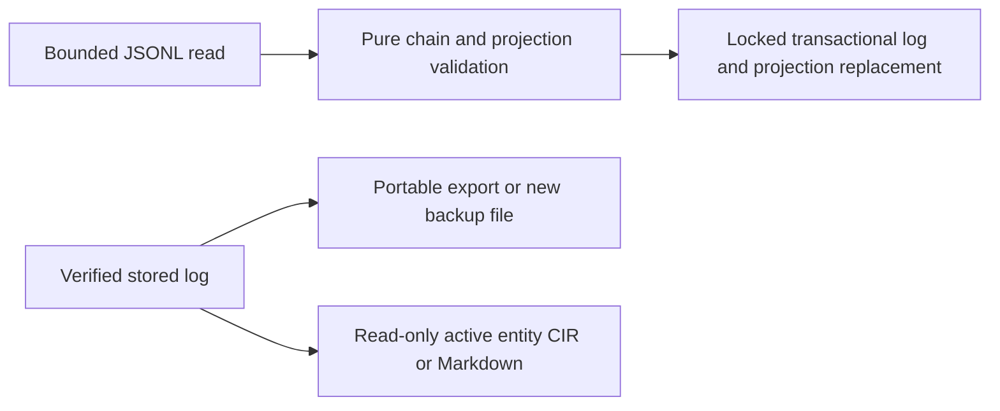

# Task: Verified state transfer

## Objective and scope

Finish export/import/backup/restore in CLI and store under
`feat(cli): add verified state transfer`.

## Decisions and operational impact

JSONL transfers the authoritative event log. CIR/Markdown present active entities
and are not restorable archives. Import replaces the log, rather than merging
project identities. Configuration and repository files are not transferred.
Verify before opening the destination; rebuild projections in one transaction.
Backups refuse existing paths to prevent truncating state or an earlier backup.
Bound actual input reads to 32 MiB. No database schema changes.

## Validation

Passed on Windows: `cargo test --workspace --offline`,
`cargo clippy --workspace --all-targets --offline -- -D warnings`, and
`cargo fmt --all --check`. Three CLI integration tests cover round trips,
fresh restoration, projections, read-only formats, malformed/tampered/oversized
input and existing destination preservation. A store test covers invalid archive
rejection and recovery over a corrupt event log.

## Changed paths and limits

- `crates/cli/src/{main,transfer}.rs`, `crates/cli/tests/transfer.rs`.
- `crates/store/src/lib.rs`, `crates/store/tests/store_tests.rs`.
- Restore can replace corrupt event contents in a readable SQLite database.
  Physical database corruption requires a fresh state directory; no automatic
  deletion is performed. Configuration is retained or defaults on a fresh restore.
- Backups are unencrypted JSONL, capped at 32 MiB, and require a new destination.
  Interrupted writes can leave an incomplete new backup; import rejects malformed
  or broken-chain input. A valid prefix cannot be detected as a truncated archive
  without a separate expected tail hash. Existing backups are never overwritten.
- Linux/macOS checks and complete phase exit workflows remain unrun.

## Next step

Continue with standalone indexing and persistent snapshots, then phase exit
validation and the phase 3-5 handoff.
