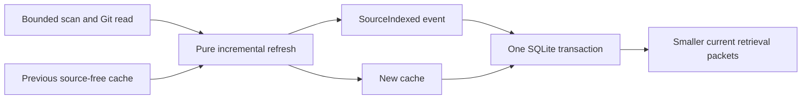

# Task: Persistent incremental index

## Objective

Implement `middleman index [--full|--changed]` and persist the source-free
incremental cache that lets harness-facing retrieval reuse parsing and graph
fragments across processes.

## Contract and design

The event log remains the authoritative durable history. The SQLite snapshot is
a replaceable performance cache: it contains hashes, parsed structural facts,
derived entities, edges and evidence locations, but never repository file bodies,
prompts or command output. A malformed cache is ignored and rebuilt. A failed
scan leaves both its cache and event state unchanged.

Each successful index appends `SourceIndexed` and replaces the cache in the same
writer-locked transaction. Import and restore clear it because an event archive
does not contain cache data. Retrieval keeps a bounded scan for current hashes,
Git evidence and hints, then reuses unchanged parser facts and fragments from the
last cache.

## Changes and validation

- Added serializable, validated index-cache encoding to `middleman-indexer`.
- Added migration 2 and atomic snapshot reads/writes to `middleman-store`.
- Added the CLI command and reuse to retrieval in `middleman-cli`.
- `crates/cli/tests/index.rs` covers initial indexing, cross-process cache reuse,
  changed-file refresh, source-body exclusion and invalid option atomicity.
- Passed on Windows: `cargo test --workspace --offline`,
  `cargo clippy --workspace --all-targets --offline -- -D warnings`, and
  `cargo fmt --all --check`.

## Limits and next step

Hash verification still reads each eligible file. Incrementality avoids parsing
and graph-fragment construction for unchanged files; it is not a filesystem
performance claim. Serialized structural facts can include extracted identifiers,
module names, imports and declarations used by packets; they do not retain file
bodies. The format is internal and versioned by compatible binary/schema; a bad
or incompatible cache falls back to a full refresh.

Next: complete the Phase 2 agent-guide answers and document the Phase 3-5 harness
adapter handoff.
