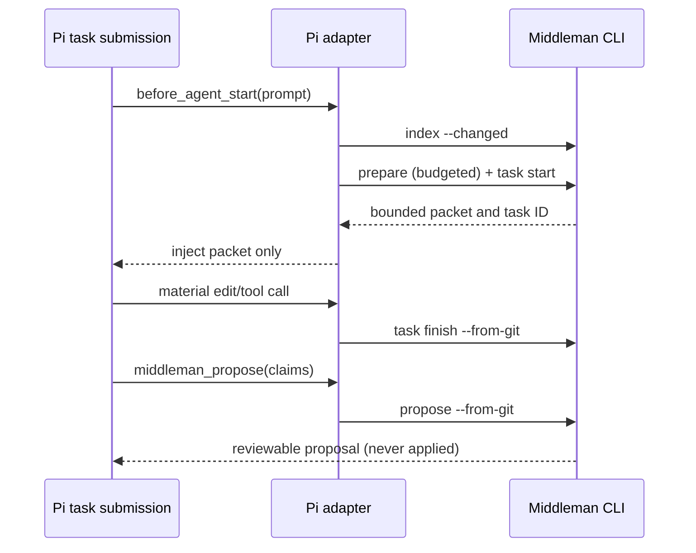

# Task: Phase 3 Pi adapter

## Objective

Complete Phase 3 with a Pi extension that automatically indexes and prepares a
bounded context packet after a task submission, while keeping durable-memory
changes reviewable.

## Scope

- Files / modules: `crates/adapters/pi/`, `docs/integrations/pi.md`
- Explicitly out of scope: Kilo and Cline adapters, network transport,
  automatic acceptance of durable-memory claims, and persistence of prompts or
  raw tool output.

## Contract and operational impact

- Callers / consumers affected: Pi users who install the two extension files.
- Data ownership or schema impact: session state stores only a Middleman task
  ID and lifecycle flags; Middleman remains the owner of index and proposal
  state.
- Compatibility / migration path: no existing adapter contract changes; the
  CLI remains the fallback and can be used without Pi.
- Rollback or recovery path: remove the two files from `.pi/extensions/`; no
  tracked project state is changed by installation.

## Functional design

- Pure rule / transformation / state transition: `createLifecycle` maps
  command outcomes to packet, unavailable, and proposal-required states while
  retaining only a task ID and boolean flags.
- Effect boundary or adapter: the Pi extension invokes only the local
  `middleman` CLI and creates an ephemeral proposal input under
  `.middleman/cache`.
- Intentional mutation or non-determinism, if any: task/index/proposal events
  are appended by the existing CLI; random temporary proposal filenames are
  removed in a `finally` block.

## Decisions

- Use Pi's `before_agent_start`, `tool_call`, and `agent_settled` hooks, as
  documented by the current Pi extension API.
- Do not generate claims at settlement: only the agent can provide structured,
  evidence-backed claims, and `middleman_propose` still requires explicit
  review before application.

## Changes made

- Added a source-free lifecycle coordinator plus mocked Node contract tests.
- Added the Pi extension, bounded expand/propose tools, and local installation
  instructions.
- Kept proposal apply/reject outside the extension and removed temporary
  structured proposal input after every call.

## Validation

- Command: `node --test crates/adapters/pi/middleman-lifecycle.test.mjs`
- Result: passed (4 tests).
- Command: `cargo test --workspace --offline`
- Result: passed.
- Command: `cargo clippy --workspace --all-targets --offline -- -D warnings`
- Result: passed (Windows emitted only its pre-existing home-path canonicalization warning).
- Command: `cargo fmt --all --check`
- Result: passed (same warning).
- Pi's TypeScript runtime is not installed in this workspace, so the extension
  was validated through mocked lifecycle contracts rather than a live Pi run.

## Next step / handoff

Phase 4 should add only documented Kilo/Cline integration paths. The
pre-existing `Cargo.lock` working-copy change was intentionally not included in
this slice.
