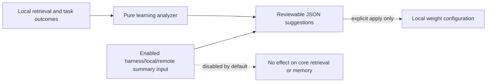

# Task: Phase 5 learning and optional AI

## Objective

Turn locally recorded retrieval outcomes into deterministic, reviewable
maintenance suggestions. Keep optional AI disabled by default and unable to
write durable project memory or routing configuration silently.

## Scope

- Files / modules: `crates/core/src/learning.rs`, `crates/core/src/config.rs`,
  `crates/cli/src/learning.rs`, task lifecycle and focused tests.
- Explicitly out of scope: embeddings, vector databases, model credentials,
  network requests, autonomous memory writes, and execution of model commands.

## Contract and operational impact

- Callers / consumers affected: CLI users may inspect learning suggestions and
  explicitly apply a deterministic retrieval-weight proposal.
- Data ownership or schema impact: observations remain source-free event-log
  records. Applying weights changes only local `.middleman/middleman.toml`.
- Compatibility / migration path: existing configs default optional AI to
  disabled and retain baseline retrieval behaviour until outcomes exist.
- Rollback or recovery path: restore the prior TOML weights or remove the
  optional configuration block. No event-log mutation is needed for a weight
  rollback.

## Functional design

- Pure rule / transformation / state transition: aggregate bounded outcome
  records per entity, cap tuning adjustments, and derive stable suggestions for
  weights, missing documentation, routing review, and stale decisions.
- Effect boundary or adapter: the CLI reads local state and rewrites only the
  local TOML after an explicit apply request; AI summary intake is validated
  structured input and never executes a model, command, or request.
- Intentional mutation or non-determinism, if any: task completion adds
  evidence-backed overlap outcomes; clocked event timestamps remain at the CLI
  boundary.

## Decisions

- Core scoring stays deterministic. Learned history is a bounded adjustment,
  never a replacement for exact path, symbol, contract, or test signals.
- Suggestions are explanatory and must show their local evidence counts.
- Optional AI is a proposal-input contract, not a credential manager or a
  transport; it cannot accept or write durable facts.

## Changes made

- Added a pure, capped outcome analyzer and integrated its adjustments only as
  tie-break information for candidates that already have deterministic routing
  evidence.
- Added `middleman learn suggest`, `apply`, and `observe`; task completion now
  records source-free file/test overlap signals for its selected scope.
- Added reviewable missing-documentation, routing-rule, and stale-decision
  suggestions with local evidence counts.
- Added an optional-AI configuration gate and bounded structured proposal
  intake. It never calls a model, persists proposal content, or accepts durable
  memory changes.

## Validation

- Command: `cargo test -p middleman-cli --test learning --offline`
- Result: passed (2 Phase 5 integration tests).
- Command: `cargo fmt --all --check`
- Result: passed.
- Command: `cargo clippy --workspace --all-targets --offline -- -D warnings`
- Result: passed (the Windows environment emitted its existing home-path
  canonicalization warning).
- Command: `cargo test --workspace --offline`
- Result: passed (same environment warning only).

## Next step / handoff

Read this note with the implementation specification section 16 and the
learning module before extending model integrations.
