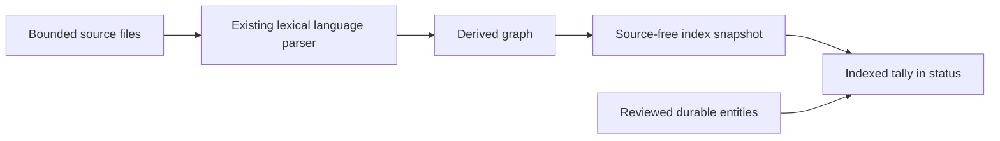

# Task: Language index visibility and framework coverage

## Objective

Make the derived source index visible in `middleman status` so a project with
no reviewed durable memory is not misreported as having no indexed entities.
Prove the existing bounded TypeScript/TSX, Laravel/PHP, and Rust paths against
representative repository fixtures.

## Scope

- Files / modules: `crates/cli/src/main.rs`, CLI/indexer integration tests, and
  deterministic TypeScript/React Native fixture inputs.
- Explicitly out of scope: TypeScript compilation, JSX evaluation, React Native
  Metro configuration, Laravel bootstrapping, PHP reflection, Cargo execution,
  package installation, and changes to co-change scoring.

## Contract and operational impact

- Callers / consumers affected: CLI users gain a separate derived-index tally
  in `status`; existing packet and graph consumers are unchanged.
- Data ownership or schema impact: none. The tally reads the existing
  source-free index snapshot and does not persist another projection.
- Compatibility / migration path: the former ambiguous `entities` line becomes
  an explicit reviewed-memory count; a new `indexed` line reports source-derived
  modules, symbols, tests, and documents.
- Rollback or recovery path: revert the display-only CLI change. Existing index
  snapshots and event logs remain valid.

## Functional design

- Pure rule / transformation / state transition: count entity kinds from a
  decoded graph snapshot; fixture graphs assert known language-specific nodes
  and import relationships.
- Effect boundary or adapter: `status` reads the local SQLite snapshot only;
  fixtures are static input data and never execute source or install packages.
- Intentional mutation or non-determinism, if any: none beyond existing index
  writes performed by the CLI integration test.

## Decisions

- React and React Native are indexed through TypeScript/JavaScript source
  forms, especially `.tsx`/`.jsx`; no framework runtime inspection is needed
  for declaration, import, and test discovery.
- Laravel remains a bounded PHP path: namespace and `use` statements establish
  conservative module relationships without executing Artisan or booting the
  application.
- Rust remains a bounded `.rs` path with Cargo manifest metadata for local
  crate/import resolution, never invoking Cargo.

## Changes made

- `status` now reports reviewed durable-memory entities separately from a tally
  of source-derived modules, symbols, tests, and documents in the existing
  index snapshot.
- Added a static React Native TypeScript/TSX fixture and graph assertions for
  React Native, Laravel/PHP, and Rust declarations plus conservative local
  import relationships.
- Kept parsing lexical and bounded: no framework runtime, compiler, package
  manager, or project source is executed.

## Validation

- Command: `cargo test --offline -p middleman-cli --test index`
- Result: passed (3 tests).
- Command: `cargo test --offline -p middleman-indexer --test graph_refresh --test language_observations`
- Result: passed (20 tests).
- Command: `cargo test --workspace --offline`
- Result: passed (the Windows environment emitted its existing home-path
  canonicalization warning only).
- Command: `cargo clippy --workspace --all-targets --offline -- -D warnings`
- Result: passed (same environment warning only).
- Command: `cargo fmt --all --check`
- Result: passed (same environment warning only).

## Next step / handoff

Read this note, `crates/indexer/src/language.rs`, and
`crates/indexer/src/graph/facts.rs` before extending any language-specific
extraction. Preserve the lexical, bounded, no-execution boundary.
